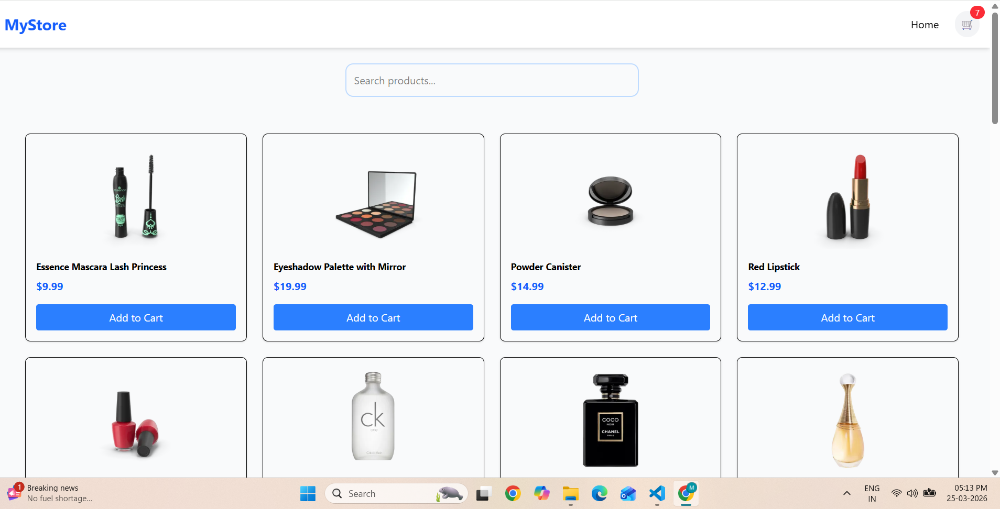
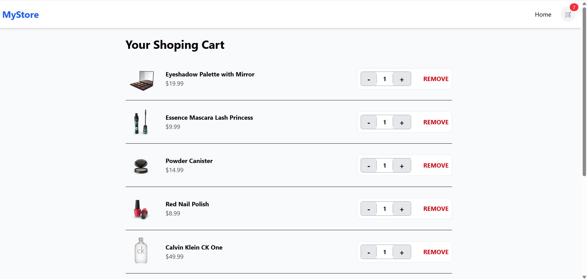

# 🛒 React Modern E-Commerce Store

A fully functional, responsive E-commerce application built with **React**, **Vite**, and **Tailwind CSS v4**. This project demonstrates professional frontend skills including global state management, dynamic routing, and real-time data fetching.






## 🚀 Live Demo
[View Live Project on Vercel](https://my-ecommerce-store-drab.vercel.app/)

## ✨ Features
- **Full CRUD Cart**: Add, remove, and update item quantities using React Context API.
- **Dynamic Routing**: Individual product detail pages using `react-router-dom` and `useParams`.
- **Real-time Search**: Instant product filtering as you type.
- **Persistent State**: Cart items are saved to `localStorage` so they stay even after refresh.
- **Modern UI**: Styled with **Tailwind CSS v4** for a clean, mobile-responsive experience.
- **Toast Notifications**: Interactive feedback when adding items to the cart.

## 🛠️ Tech Stack
- **Frontend**: React.js (Hooks, Context API)
- **Tooling**: Vite (for lightning-fast development)
- **Styling**: Tailwind CSS v4
- **Routing**: React Router v7
- **API**: DummyJSON API

## 📦 Installation & Setup

1. **Clone the repo:**
   ```bash
   git clone [REPLACE_WITH_YOUR_GITHUB_REPO_URL]
